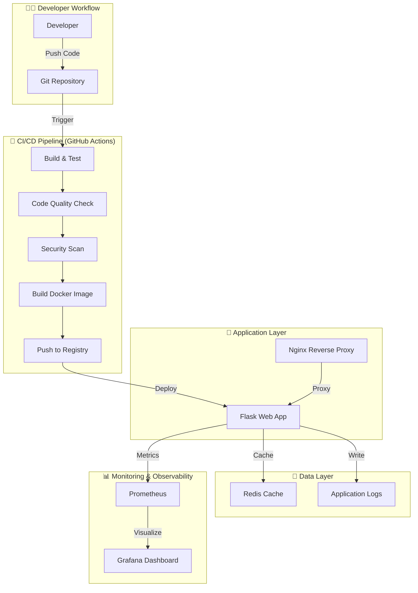
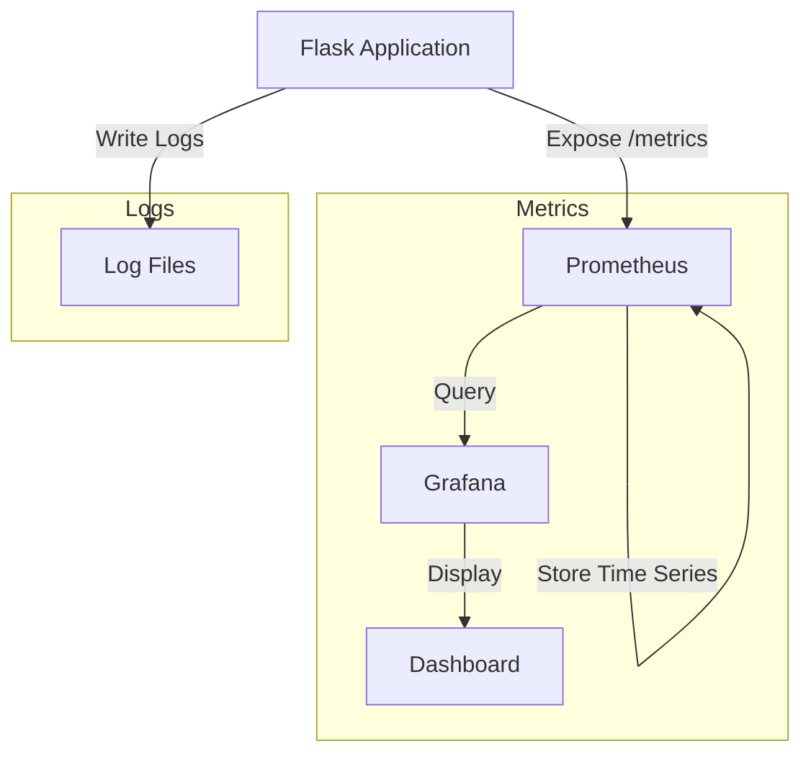
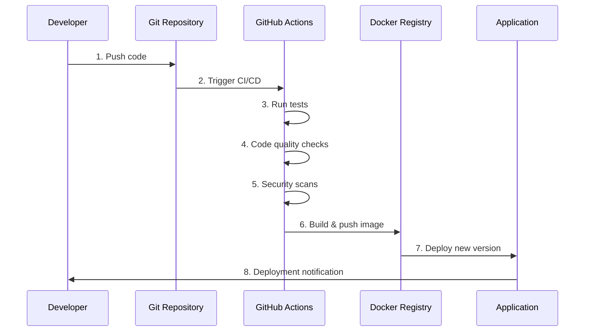

# DevOps Showcase Project - Architecture Documentation

## 🎯 Project Overview

This project demonstrates a complete DevOps workflow by building and deploying a Flask web application with automated CI/CD pipelines, containerization, monitoring, and security best practices.

**Purpose**: Showcase fundamental DevOps practices including continuous integration, continuous deployment, infrastructure as code, monitoring, and automated testing.

---

## 🏗️ System Architecture

### High-Level Architecture



---

## 📦 Project Components

### 1. **Web Application (Flask)**
- **Technology**: Python 3.11+ with Flask framework
- **Purpose**: Simple web application with health checks and API endpoints
- **Features**:
  - REST API endpoints
  - Health check endpoint (`/health`)
  - Metrics endpoint (`/metrics`) for Prometheus
  - Redis integration for caching
  - Structured logging

### 2. **Containerization (Docker)**
- **Multi-stage Docker build** for optimized image size
- **Docker Compose** for orchestrating multiple services
- **Services**:
  - `web`: Flask application
  - `nginx`: Reverse proxy
  - `redis`: Caching layer
  - `prometheus`: Metrics collection
  - `grafana`: Metrics visualization

### 3. **CI/CD Pipeline (GitHub Actions)**

```mermaid
flowchart LR
    PUSH[Git Push] --> CHECKOUT[Checkout Code]
    CHECKOUT --> SETUP[Setup Environment]
    SETUP --> DEPS[Install Dependencies]
    DEPS --> LINT[Run Linters]
    LINT --> TEST[Run Tests]
    TEST --> SECURITY[Security Scan]
    SECURITY --> BUILD[Build Docker Image]
    BUILD --> SCAN[Scan Image]
    SCAN --> PUSH_IMG[Push to Registry]
    PUSH_IMG --> DEPLOY[Deploy]
```



**Pipeline Stages**:
1. **Code Quality**: Linting (flake8, black, pylint)
2. **Testing**: Unit tests, integration tests, coverage reports
3. **Security**: Dependency scanning (safety), Docker image scanning (Trivy)
4. **Build**: Docker image creation with versioning
5. **Deploy**: Automated deployment (optional)

### 4. **Infrastructure as Code**
- **Docker Compose**: Local development and production setup
- **Environment Configuration**: `.env` files for different environments
- **Network Configuration**: Isolated Docker networks for security

### 5. **Monitoring & Observability**



**Monitoring Components**:
- **Prometheus**: Collects application metrics
- **Grafana**: Visualizes metrics with dashboards
- **Application Logs**: Structured JSON logging
- **Health Checks**: Automated health monitoring

---

## 🗂️ Repository Structure

```
devops-starter-project/
├── .github/
│   └── workflows/
│       ├── ci-cd.yml              # Main CI/CD pipeline
│       ├── security-scan.yml      # Security scanning workflow
│       └── docker-build.yml       # Docker build workflow
│
├── app/
│   ├── __init__.py               # Flask app initialization
│   ├── main.py                   # Main application entry point
│   ├── routes/
│   │   ├── __init__.py
│   │   ├── api.py                # API endpoints
│   │   └── health.py             # Health check endpoints
│   ├── services/
│   │   ├── __init__.py
│   │   └── cache_service.py      # Redis caching service
│   ├── utils/
│   │   ├── __init__.py
│   │   ├── logger.py             # Logging configuration
│   │   └── metrics.py            # Prometheus metrics
│   └── config.py                 # Application configuration
│
├── tests/
│   ├── __init__.py
│   ├── unit/
│   │   ├── test_routes.py
│   │   └── test_services.py
│   ├── integration/
│   │   └── test_api.py
│   └── conftest.py               # Pytest configuration
│
├── docker/
│   ├── Dockerfile                # Multi-stage production Dockerfile
│   ├── Dockerfile.dev            # Development Dockerfile
│   └── nginx/
│       └── nginx.conf            # Nginx configuration
│
├── monitoring/
│   ├── prometheus/
│   │   └── prometheus.yml        # Prometheus configuration
│   └── grafana/
│       ├── dashboards/
│       │   └── app-dashboard.json
│       └── datasources.yml       # Grafana datasource config
│
├── infrastructure/
│   ├── docker-compose.yml        # Production compose file
│   ├── docker-compose.dev.yml    # Development compose file
│   └── .env.example              # Environment variables template
│
├── scripts/
│   ├── setup.sh                  # Initial setup script
│   ├── run-tests.sh              # Test execution script
│   └── deploy.sh                 # Deployment script
│
├── docs/
│   ├── SETUP.md                  # Setup instructions
│   ├── DEPLOYMENT.md             # Deployment guide
│   ├── MONITORING.md             # Monitoring guide
│   └── TROUBLESHOOTING.md        # Common issues and solutions
│
├── .gitignore
├── .dockerignore
├── requirements.txt              # Python dependencies
├── requirements-dev.txt          # Development dependencies
├── pytest.ini                    # Pytest configuration
├── .flake8                       # Flake8 configuration
├── pyproject.toml                # Black and other tools config
├── README.md                     # Project documentation
├── ARCHITECTURE.md               # This file
├── LICENSE
└── CHANGELOG.md                  # Version history
```

---

## 🔄 DevOps Workflow

### Development Workflow



### Step-by-Step Flow:

1. **Developer pushes code** to GitHub repository
2. **GitHub Actions triggered** automatically
3. **Continuous Integration runs**:
   - Install dependencies
   - Run linters (flake8, black, pylint)
   - Execute unit tests
   - Execute integration tests
   - Generate coverage reports
4. **Security scanning**:
   - Dependency vulnerability check (safety)
   - Docker image scanning (Trivy)
5. **Docker image built**:
   - Multi-stage build for optimization
   - Tagged with version and `latest`
6. **Image pushed** to Docker Hub/GitHub Container Registry
7. **Application deployed** (manual or automatic)
8. **Monitoring activated** - Prometheus scrapes metrics

---

## 🛠️ Technology Stack

### Application Layer
- **Language**: Python 3.11+
- **Framework**: Flask 3.x
- **WSGI Server**: Gunicorn
- **Reverse Proxy**: Nginx

### Data & Caching
- **Cache**: Redis 7.x
- **Session Storage**: Redis

### DevOps Tools
- **Version Control**: Git + GitHub
- **CI/CD**: GitHub Actions
- **Containerization**: Docker + Docker Compose
- **Registry**: Docker Hub / GitHub Container Registry

### Testing & Quality
- **Testing Framework**: Pytest
- **Code Coverage**: pytest-cov
- **Linting**: flake8, pylint, black
- **Security Scanning**: safety, Trivy, Bandit

### Monitoring & Logging
- **Metrics**: Prometheus + Grafana
- **Logging**: Python logging with JSON formatter
- **Health Checks**: Custom health check endpoints

---

## 🔐 Security Practices

1. **Dependency Scanning**: Automated scanning of Python dependencies for vulnerabilities
2. **Docker Image Scanning**: Trivy scans for OS and library vulnerabilities
3. **Secrets Management**: Environment variables, no hardcoded secrets
4. **Least Privilege**: Docker containers run as non-root users
5. **Network Isolation**: Docker networks isolate services
6. **HTTPS Ready**: Nginx configured for SSL/TLS termination

---

## 📊 Monitoring Strategy

### Metrics Collected:
- **Application Metrics**:
  - Request count and latency
  - Error rates (4xx, 5xx)
  - Active users/sessions
  - Cache hit/miss ratio
  
- **System Metrics**:
  - CPU and memory usage
  - Container health status
  - Network I/O
  
- **Business Metrics**:
  - Endpoint usage statistics
  - User activity patterns

### Dashboards:
- **Application Overview**: Request rates, response times, error rates
- **System Health**: Container status, resource utilization
- **Redis Performance**: Cache performance, memory usage

---

## 🚀 Deployment Strategy

### Environments:
1. **Development**: Local development with hot-reload
2. **Testing**: Isolated environment for integration tests
3. **Production**: Optimized containers with monitoring

### Deployment Options:
- **Local**: `docker-compose up` for local testing
- **Cloud**: Deploy to AWS, Azure, GCP, or DigitalOcean
- **Container Orchestration**: Ready for Kubernetes (future enhancement)

---

## 🎓 DevOps Concepts Demonstrated

| Practice | Implementation | File/Location |
|----------|---------------|---------------|
| **Version Control** | Git with feature branches | `.git/` |
| **Continuous Integration** | Automated testing on every push | `.github/workflows/ci-cd.yml` |
| **Continuous Deployment** | Automated Docker builds | `.github/workflows/docker-build.yml` |
| **Infrastructure as Code** | Docker Compose configurations | `infrastructure/docker-compose.yml` |
| **Containerization** | Multi-stage Docker builds | `docker/Dockerfile` |
| **Automated Testing** | Unit + Integration tests | `tests/` |
| **Code Quality** | Linting and formatting | `.flake8`, `pyproject.toml` |
| **Security Scanning** | Dependency and image scanning | `.github/workflows/security-scan.yml` |
| **Monitoring** | Prometheus + Grafana | `monitoring/` |
| **Logging** | Structured JSON logging | `app/utils/logger.py` |
| **Documentation** | Comprehensive docs | `docs/`, `README.md` |

---

## 🔮 Future Enhancements

### Phase 2:
- [ ] Kubernetes deployment manifests (Helm charts)
- [ ] Terraform for cloud infrastructure
- [ ] Multi-cloud deployment (AWS, Azure, GCP)
- [ ] Blue-Green or Canary deployment strategies

### Phase 3:
- [ ] Service mesh (Istio/Linkerd)
- [ ] Advanced monitoring (ELK stack, Jaeger for tracing)
- [ ] Auto-scaling based on metrics
- [ ] Chaos engineering tests

### Phase 4:
- [ ] GitOps with ArgoCD
- [ ] Policy as Code (OPA)
- [ ] Advanced security (Vault for secrets)
- [ ] Performance testing and optimization

---

## 📚 Learning Resources

This project demonstrates concepts from:
- **The Phoenix Project** - DevOps philosophy
- **The DevOps Handbook** - Implementation practices
- **Site Reliability Engineering** - Monitoring and reliability
- **Continuous Delivery** - CI/CD best practices

---

## 🤝 Contributing

This is a learning project. Feel free to:
1. Explore the code
2. Try different configurations
3. Experiment with new tools
4. Document your learnings

---

## 📝 Notes

- This architecture is designed for **learning and demonstration**
- Production deployments may require additional security hardening
- Scale and complexity can be adjusted based on requirements
- Each component is modular and can be enhanced independently

---

**Last Updated**: 2025-12-02  
**Version**: 1.0.0  
**Maintainer**: DevOps Learning Journey
